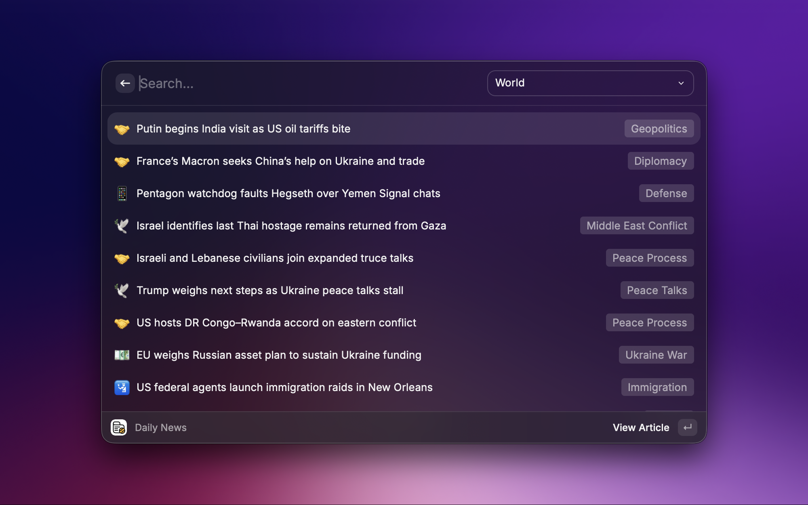
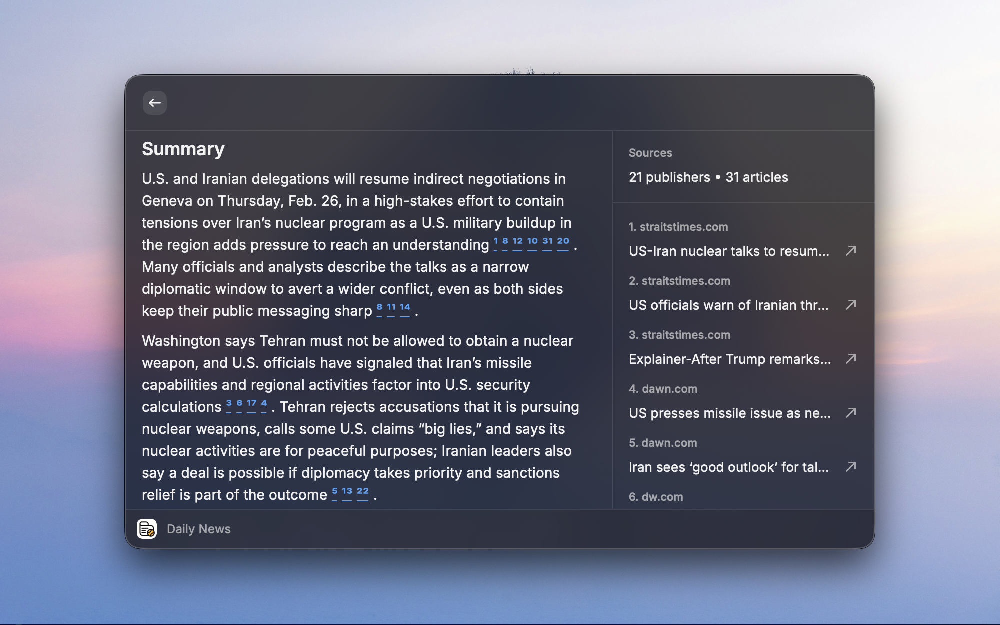
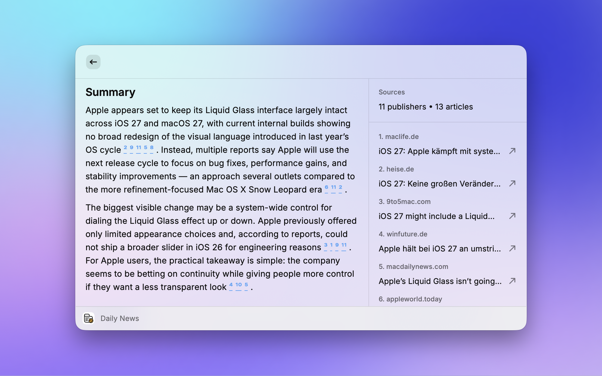

# Kagi News for Raycast
Browse news articles and sources from Kagi News directly within Raycast.

## Screenshots

  
  
  

## Features
- 🌍 **80+ news categories** - World, Technology, Science, Business, Entertainment, and more
- 📰 **Article summaries** - Get talking points and key facts at a glance
- 📅 **Historical events** - Explore what happened on this day with the OnThisDay category
- 🌐 **25+ language support** - Read news in your preferred language
- 🔗 **Clickable source references** - Access original sources directly

## Installation
This extension will soon be available in the Raycast Store. Search for "Kagi News" to install it.

## Acknowledgments
- https://github.com/kagisearch/kite-public
- https://github.com/raycast/extensions
