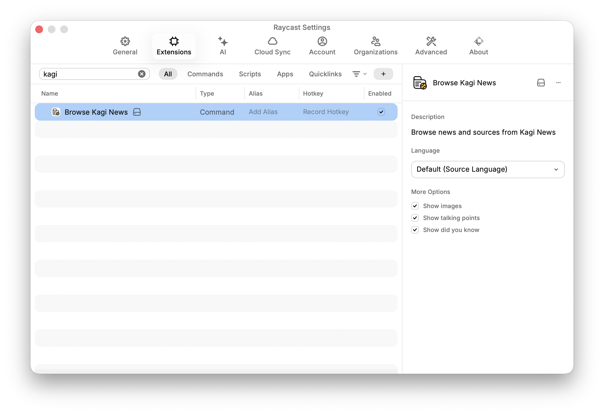

# Kagi News for Raycast

Browse news articles and sources from Kagi News directly in Raycast. Stay informed with curated news across 80+ categories, read article summaries with key talking points, and explore historical events—all without leaving Raycast.

## ✨ Features

- **80+ news categories** — World, Technology, Science, Business, Entertainment, and more
- **Smart article summaries** — Get talking points and key facts at a glance
- **Historical events** — Discover what happened on this day via the OnThisDay category
- **25+ language support** — Browse news in your preferred language
- **Clickable source references** — Jump directly to original articles
- **Always up to date** — Synced with Kagi News official JSON feed, so news and categories are always current
- **Fast and lightweight** — Optimized for speed and performance
- **Customizable display sections** — Toggle optional content like Primary Image, Talking Points, Secondary Image, Perspectives, Historical Background, Technical Details, Industry Impact, Timeline, International Reactions, and more
- **Rich article details** — View comprehensive article information tailored to your preferences

## 🎬 Screenshots

<table>
<tr>
<td align="center">

</td>
<td align="center">

</td>
</tr>
<tr>
<td align="center">

</td>
<td align="center">

</td>
</tr>
</table>

## 🚀 Quick Start

1. Open Raycast  
2. Type "Kagi News"  
3. Press `Cmd + P` to open the category selection  
4. Select a news category  
5. Browse articles beyond the 12 daily listings  
6. Press Enter to open the article in Raycast

## 🙏 Acknowledgements

- [Kagi News](https://github.com/kagisearch/kite-public) 
- [Raycast](https://github.com/raycast/extensions)

## 📥 Installation

